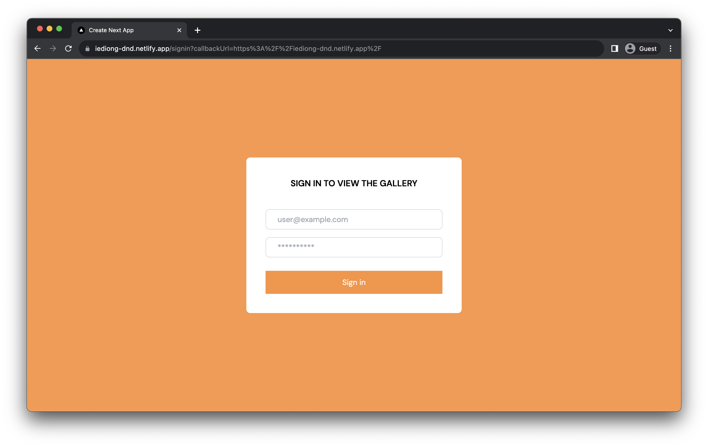
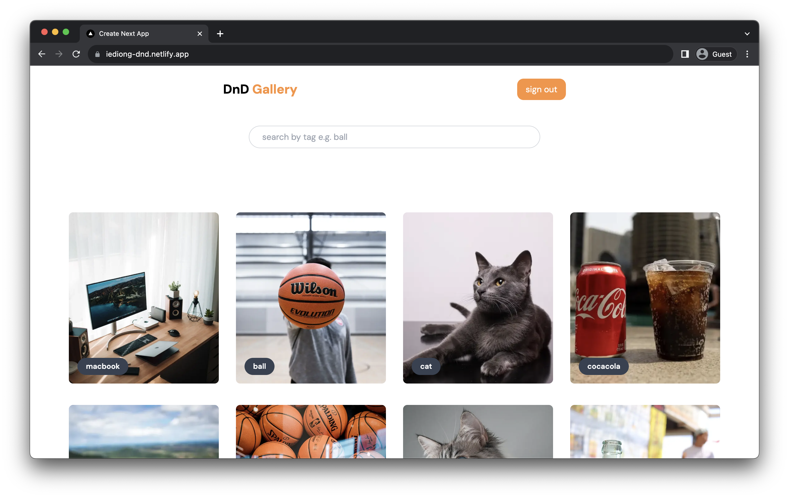
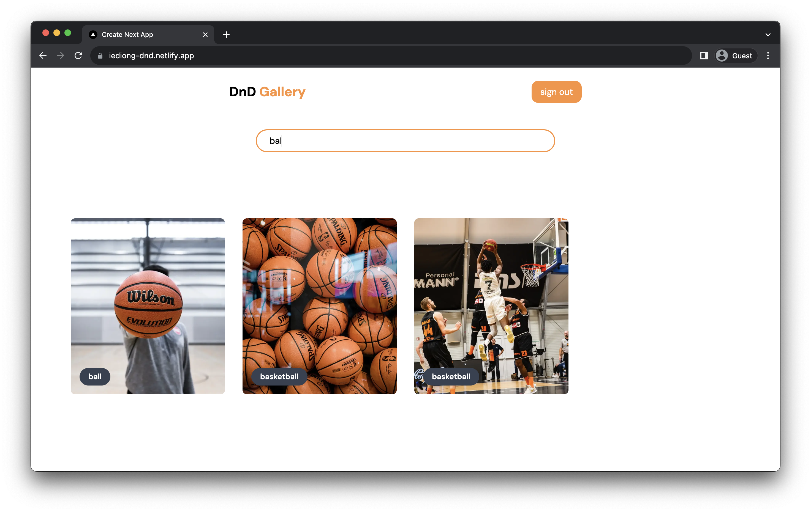

# DND Image Gallery

Welcome to the Drag-n-drop image gallery App! This web application leverages the power of Next.js and dnd-kit to give you a wonderful drag-n-drop gallery experience.

## Table of Contents

- [Getting Started](#getting-started)
  - [Preview](#preview)
  - [Tech Stack](#tech-stack)
  - [Prerequisites](#prerequisites)
  - [Installation](#installation)
- [Running the Application](#running-the-application)

## Getting Started

### Preview

| Signin page | Home page (Gallery) | Search View |
| --- | --- | --- |
|  |  |  |

### Tech Stack

- **Frontend:** React.js, Next.js
- **Styling:** TailwindCSS
- **Drag-n-drop:** Dnd kit
- **Authenication:** NextAuth
- **Deployment:** Netlify
- **Version Control:** Git, Github

### Prerequisites

List any prerequisites or dependencies that need to be installed before running the application. For example:

- [Node.js](https://nodejs.org/) (v18.10.0 or higher)
- [npm](https://www.npmjs.com/)

### Installation

1. Clone the repository:

   ```bash
   git clone https://github.com/IEdiong/movie-box.git
   ```

This is a [Next.js](https://nextjs.org/) project bootstrapped with [`create-next-app`](https://github.com/vercel/next.js/tree/canary/packages/create-next-app).

2. Navigate to the project directory:

   ```bash
   cd movie-box
   ```

3. Install project dependencies:

   ```bash
   npm install
   ```

4. Generate `NEXTAUTH_SECRET`:

   ```bash
   openssl rand -base64 32
   ```

   Copy the generated secret to your clipboard.

5. Setup environment variables: rename the provided `.env.example` file to `.env.local` and assign the `NEXTAUTH_SECRET` the value of the generated secret from the previous step.

   ```bash
   NEXTAUTH_URL=http://localhost:3000
   NEXTAUTH_SECRET=
   ```

## Running the Application

After completing the installation steps, you can run the application using the following command:

```bash
npm run dev
```

The development server will start, and the application will be accessible at [http://localhost:3000](http://localhost:3000)

```js
   // Sign in to the application with
   username: user@example.com
   password: 1Password
```

<!-- ## Key Features
- **Browse Movies:** Explore a vast library of movies across different genres and categories.

- **Movie Details:** Get detailed information about each movie, including cast, plot, release date, and more.

- **Search Functionality:** Easily find your favorite movies or discover new ones with our robust search feature. -->
